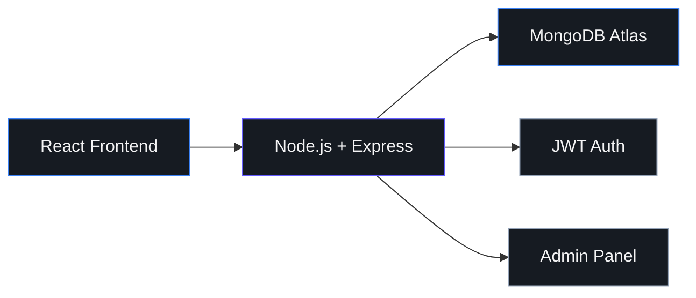
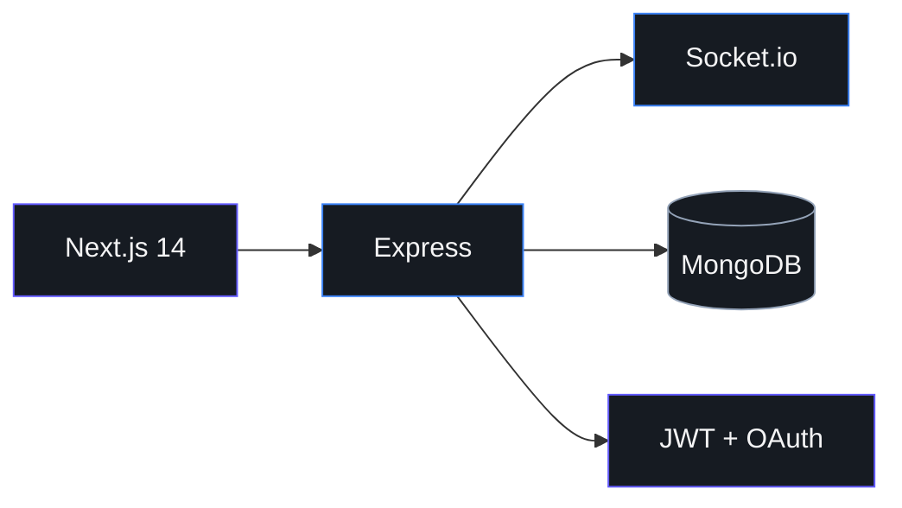

<!-- ═══════════════════════════════════════════════════════════════════════════ -->
<!-- HERO                                                                      -->
<!-- ═══════════════════════════════════════════════════════════════════════════ -->

  

  

**Technology Strategist · AI Innovation Leader · Enterprise Systems Architect**

 

 

 

 

<!-- ═══════════════════════════════════════════════════════════════════════════ -->
<!-- ABOUT                                                                     -->
<!-- ═══════════════════════════════════════════════════════════════════════════ -->

  

I'm a **Computer Science engineer from India** who builds full-stack systems where AI, cloud infrastructure, and product design meet real human needs.

 

My mission is to **democratize technology access** - building software people can actually use, without apps they can't install, forms they can't read, or interfaces that leave them behind.

 

Currently deepening **Advanced AI Engineering** & **Cloud Architecture** · React · FastAPI · Python · NLP · AWS · MongoDB

  

<table align="center" width="100%">
<tr>
<td align="center" width="33%" valign="top">

  

OpenAI · Hugging Face · LangChain 
Multi-language voice · intelligent routing

</td>
<td align="center" width="33%" valign="top">

  

Docker · Kubernetes · Terraform 
Multi-region · resilient by design

</td>
<td align="center" width="33%" valign="top">

  

React · Next.js · FastAPI · Node 
JWT · Socket.io · human-centered UI

</td>
</tr>
</table>

 

<!-- ═══════════════════════════════════════════════════════════════════════════ -->
<!-- PROJECTS                                                                  -->
<!-- ═══════════════════════════════════════════════════════════════════════════ -->

 

### 🛍️ AKS Beauty Hut - E-Commerce Platform

 

*I built AKS Beauty Hut as a fully functional e-commerce solution for a local retail business — responsive product catalog, cart & checkout, role-based admin panel, and mobile-first deployment.*

`Product Catalog` `Cart & Checkout` `JWT Auth` `Admin Inventory Panel` `Mobile-First MERN`

---

### 💬 Vibely - Modern Social Platform

 

*I built Vibely as a production-grade social platform — real-time messaging, media posts, dual authentication, and a UI polished enough to earn trust on first load.*

`Socket.io` `Google OAuth` `shadcn/ui` `Framer Motion` `Email notifications`

 

<!-- ═══════════════════════════════════════════════════════════════════════════ -->
<!-- TECH STACK                                                                -->
<!-- ═══════════════════════════════════════════════════════════════════════════ -->

  

  

<table align="center" width="100%">
<tr>
<td align="center" width="25%" valign="top"><b>AI / ML</b> Python · TensorFlow · PyTorch OpenAI · Hugging Face · LangChain</td>
<td align="center" width="25%" valign="top"><b>Development</b> React · Next.js · Node.js Express · FastAPI · TypeScript</td>
<td align="center" width="25%" valign="top"><b>Data</b> MongoDB · PostgreSQL · Redis DynamoDB · Pinecone</td>
<td align="center" width="25%" valign="top"><b>Cloud / DevOps</b> AWS · Docker · Kubernetes Terraform · Serverless · Actions</td>
</tr>
</table>

 

<!-- ═══════════════════════════════════════════════════════════════════════════ -->
<!-- GITHUB ACTIVITY                                                           -->
<!-- ═══════════════════════════════════════════════════════════════════════════ -->

  

<table align="center" width="100%">
<tr>
<td align="center" width="50%">

</td>
<td align="center" width="50%">

</td>
</tr>
<tr>
<td align="center" colspan="2" width="100%">

</td>
</tr>
<tr>
<td align="center" colspan="2" width="100%">

</td>
</tr>
</table>

 

<!-- ═══════════════════════════════════════════════════════════════════════════ -->
<!-- CREDENTIALS                                                               -->
<!-- ═══════════════════════════════════════════════════════════════════════════ -->

  

  

  

Real-time systems · Clean UI/UX · Production-ready architecture

 

<!-- ═══════════════════════════════════════════════════════════════════════════ -->
<!-- CONNECT                                                                   -->
<!-- ═══════════════════════════════════════════════════════════════════════════ -->

  

I'm open to **full-time roles**, **freelance**, **consulting**, **startup collaboration**, **speaking**, and **strategic partnerships**.

 

If you're building at the intersection of **AI**, **cloud**, and **human-centered product** — let's talk.

  

| | |
|:---:|:---|
| **Email** | [roshankumarsingh021@gmail.com](mailto:roshankumarsingh021@gmail.com) |
| **LinkedIn** | [roshan-kumar-singh-1205-dev](https://www.linkedin.com/in/roshan-kumar-singh-1205-dev/) |
| **GitHub** | [roshan-1205](https://github.com/roshan-1205) |
| **LeetCode** | [roshan-1205](https://leetcode.com/roshan-1205) |
| **Portfolio** | [roshan-portfolio-indol.vercel.app](https://roshan-portfolio-indol.vercel.app) |

 

 

<!-- ═══════════════════════════════════════════════════════════════════════════ -->
<!-- FOOTER                                                                    -->
<!-- ═══════════════════════════════════════════════════════════════════════════ -->

  

<picture>
  <source media="(prefers-color-scheme: dark)" srcset="https://raw.githubusercontent.com/roshan-1205/roshan-1205/output/github-contribution-grid-snake-dark.svg">
  <source media="(prefers-color-scheme: light)" srcset="https://raw.githubusercontent.com/roshan-1205/roshan-1205/output/github-contribution-grid-snake.svg">
  
</picture>

 

© Roshan Kumar Singh · India · B.Tech CSE · Learning Advanced AI Engineering & Cloud Architecture

